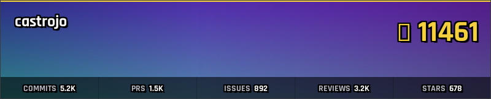
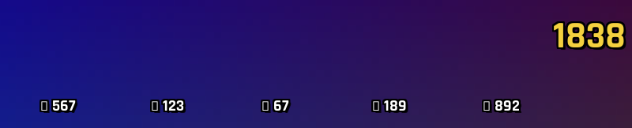
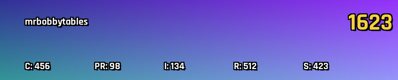
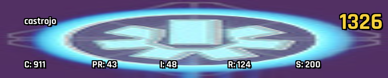

# ContribEmblem

Generate Destiny 2-style emblem badges that showcase your GitHub contribution statistics.

## Overview

ContribEmblem is a GitHub Action that automatically generates and updates a personalized emblem badge featuring:

- **Weekly rotating emblems** from Destiny 2's extensive collection
- **Power Level calculation** based on your GitHub activity metrics
- **Auto-updating images** that refresh weekly via GitHub Actions
- **Stable embed URLs** for use in profiles, READMEs, and websites

### Recent Updates

- ✅ **Username Display** - Badges now show your GitHub username in the top-left corner
- ✅ **ASCII Stat Labels** - Clear, readable stat indicators (C:, PR:, I:, R:, S:)
- ✅ **Improved Dimensions** - Badge uses proper 800×162px aspect ratio matching Destiny 2 emblems
- ✅ **Valid Emblem Hashes** - Now uses confirmed Destiny 2 emblems with real artwork (not Ghost Projections)

## Examples

Here are some example badges showcasing different contribution profiles:

### @castrojo (Power Level: 2568)


*High activity across all contribution areas - commits, PRs, issues, reviews, and popular repositories.*

### @jeefy (Power Level: 1838)


*Balanced contributions with strong review activity and consistent commits.*

### @mrbobbytables (Power Level: 1623)


*Community-focused contributor with emphasis on code reviews and issue engagement.*

> **Note:** These are demonstration badges with sample stats to showcase the visual style. Your actual badge will reflect your real GitHub contribution data.

## Features

### 🎮 Destiny 2 Aesthetic
Your emblem rotates weekly from Destiny 2's emblem collection, giving your profile a fresh look while maintaining the iconic Destiny visual style.

### 📊 GitHub Stats Integration
Your "Power Level" is calculated from 5 key GitHub metrics:
- **Commits** - Total commits this year
- **Pull Requests** - PRs opened and merged
- **Issues** - Issues created and commented on
- **Reviews** - Code reviews completed
- **Stars** - Total stars across all your repositories

### 🔄 Automatic Updates
The emblem updates every Sunday at midnight UTC via GitHub Actions. No manual intervention required.

### 🖼️ Easy Embedding
Use stable GitHub URLs to embed your emblem anywhere:

```markdown

```

## Setup

### Prerequisites
- A GitHub account
- A Bungie.net API key (free) - [Get one here](https://www.bungie.net/en/Application)

### Installation

1. **Fork or clone this repository**

2. **Add secrets to your repository:**
   - Go to Settings → Secrets and variables → Actions
   - Add `BUNGIE_API_KEY` with your Bungie API key

3. **Configure your badge (choose one):**
   
   **Option A: YAML Configuration (Recommended)**
   - Create `contribemblem.yml` in your repository root
   - Set your username and customize metrics/emblems
   - See [Configuration](#configuration) section for full details
   
   **Option B: JSON Configuration (Legacy)**
   - Edit `data/emblem-config.json` to customize emblem rotation
   - Find emblem hashes at [Destiny 2 API documentation](https://bungie-net.github.io/)

4. **Enable GitHub Actions:**
   - The workflow will run automatically every Sunday at midnight UTC
   - Or manually trigger it from the Actions tab

## Local Development

### Building

```bash
# Build the binary
make build

# Run tests
make test

# Run the full pipeline locally (option 1: environment variables)
export GITHUB_TOKEN=your_token
export GITHUB_ACTOR=your_username
export BUNGIE_API_KEY=your_key
./contribemblem run

# Run the full pipeline locally (option 2: config file)
# Create contribemblem.yml with your username
export GITHUB_TOKEN=your_token
export BUNGIE_API_KEY=your_key
./contribemblem run
```

### CLI Commands

The `contribemblem` binary supports these subcommands:

```bash
contribemblem fetch-stats      # Fetch GitHub stats via GraphQL
contribemblem select-emblem    # Select weekly emblem hash
contribemblem fetch-emblem     # Fetch emblem image from Bungie API
contribemblem generate         # Generate badge image
contribemblem run              # Run full pipeline
contribemblem help             # Show help message
```

## Configuration

ContribEmblem supports two configuration methods:

### Option 1: YAML Configuration (Recommended)

Create a `contribemblem.yml` file in your repository root:

```yaml
username: your-github-username

metrics:
  commits: true
  pull_requests: true
  issues: true
  reviews: true
  stars: true

emblems:
  rotation:
    - "4052831236"  # Activate ESCALATION (orange/red Warmind)
    - "1901885391"  # A Crimson Cathedral (deep red/crimson)
    - "1661191194"  # A Hall of Delights (gold/Leviathan opulent)
  fallback: "4052831236"
```

**Configuration options:**
- `username` - Your GitHub username (overrides `GITHUB_ACTOR` env var)
- `metrics` - Toggle which stats appear on your badge
- `emblems.rotation` - Array of Bungie emblem hashes to rotate through weekly
- `emblems.fallback` - Emblem to use if rotation is empty or unavailable

### Option 2: JSON Configuration (Legacy)

Edit `data/emblem-config.json` to customize your emblem rotation:

```json
{
  "rotation": [
    "4052831236",
    "1901885391",
    "1661191194"
  ],
  "fallback": "4052831236"
}
```

- `rotation`: Array of Bungie emblem hashes to rotate through weekly
- `fallback`: Emblem to use if rotation is empty or config is missing

> **Note:** YAML configuration (`contribemblem.yml`) takes precedence over JSON configuration. If both exist, the YAML file will be used.

## Technical Details

- **Language:** Pure Go (no CGo dependencies)
- **Image Generation:** stdlib + `golang.org/x/image`
- **Badge Size:** 800×162px PNG (matches Destiny 2's 474:96 emblem aspect ratio)
- **Font:** Inter (embedded via `go:embed`)
- **Caching:** Manifest cache persists until manually deleted (daily refresh in CI via cache keys)
- **Configuration:** YAML (`contribemblem.yml`) or JSON (`data/emblem-config.json`)
- **Testing:** Core functionality tests with additional test coverage in progress

## License

See [LICENSE](LICENSE) for details.

## Inspiration

Inspired by Destiny 2's iconic emblem system and the desire to bring that visual flair to GitHub profiles.

<!-- CONTRIBEMBLEM:START -->


*Last updated: February 7, 2026*
<!-- CONTRIBEMBLEM:END -->
